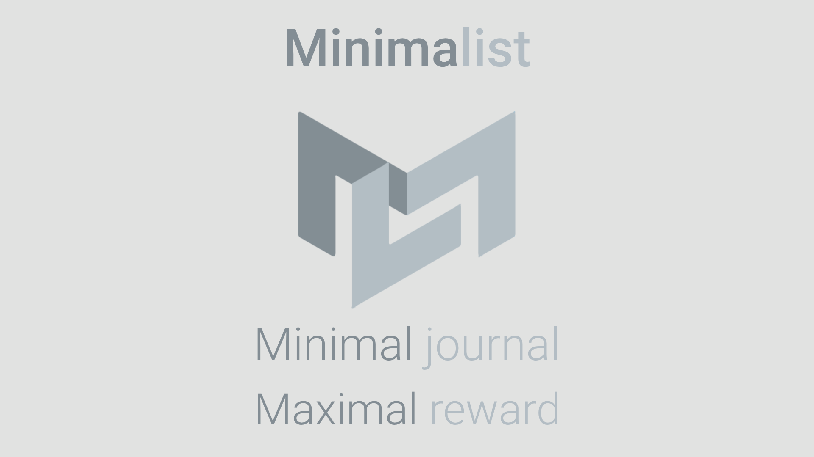
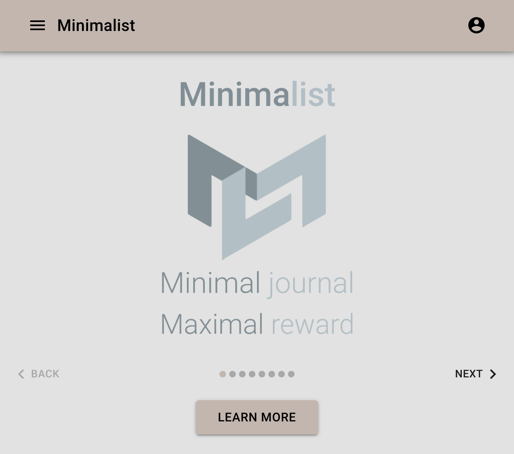

# Minimalist
A minimal journaling app that guides users through daily, weekly, and monthly self-reflections. Intentionally minimal. Incredibly powerful.

### Purpose and Usefulness
Machines are great at taking in data and course correcting. Humans aren't as great, it turns out. Even though self-reflection is essesstial to our growth, surveys show that people would rather receive small amounts of electic shocks than have to sit for 15 minutes doing nothing but self-reflection. Minimalist takes the pain out of this process by making self-reflection quick, easy, and helpful. Three questions at the end of every day, three questions at the end of every week, and three questions at the end of every month. All of a sudden, you might notice trends when you look back on your week or month. The included habit tracker also helps you see your habits grow over time. It's all about growth over time. When you take minimal time to do minimal journaling, you'll find the rewards aren't minimal.

### Features
  * Daily View
  * Weekly View
  * Monthly View
  * Habit Tracker
  * Account Dashboard

### DEMO

### Links
Github Repository: https://github.com/markpython86/Project-3
Live Heroku Link: 

### Technologies Used
  * Javascript
  * MongoDB
  * Express
  * React
  * Mongoose
  * Morgan
  * Heroku
  * Material-UI
  * Webpack
  * JWT Authentication
  
### Downloading the Repo and Running it Locally
1. Clone repository using the code -> _git clone https://github.com/markpython86/Project-3.git
2. Open a terminal session for the directory where the application was cloned to
3. Run *npm install* to install all the dependencies
4. Run *mongod* to get the daemon running for MongoDB
3. Be sure to run *npm run dev* in both the server and client folders

#### Enjoy!

