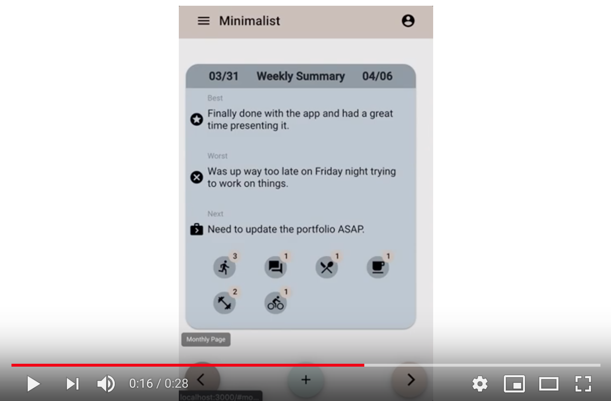

# Minimalist
A minimal journaling app that helps users make daily, weekly, and monthly self-reflections.

### DEMO
Github Repository: https://github.com/danielpolk/spurs-news

Live Heroku Link: https://spurs-news.herokuapp.com/

### Purpose and Usefulness
This is built for Spurs news junkies. It gives users and ad free browsing experience, along with the abilities to save, and comment on news articles.

### Technologies Used
  * Javascript
  * jQuery
  * MongoDB
  * Axios
  * Cheerio
  * Express
  * Express Handlebars
  * Mongoose
  * Morgan
  * Heroku
  * Bootstrap
  
### Getting Started
1. Clone repository TrainScheduleApp using the code -> _git clone https://github.com/danielpolk/TrainScheduleApp.git
2. Open a terminal session for the directory where the application was cloned to
3. run *npm install* to install all the dependencies

#### Good luck!
